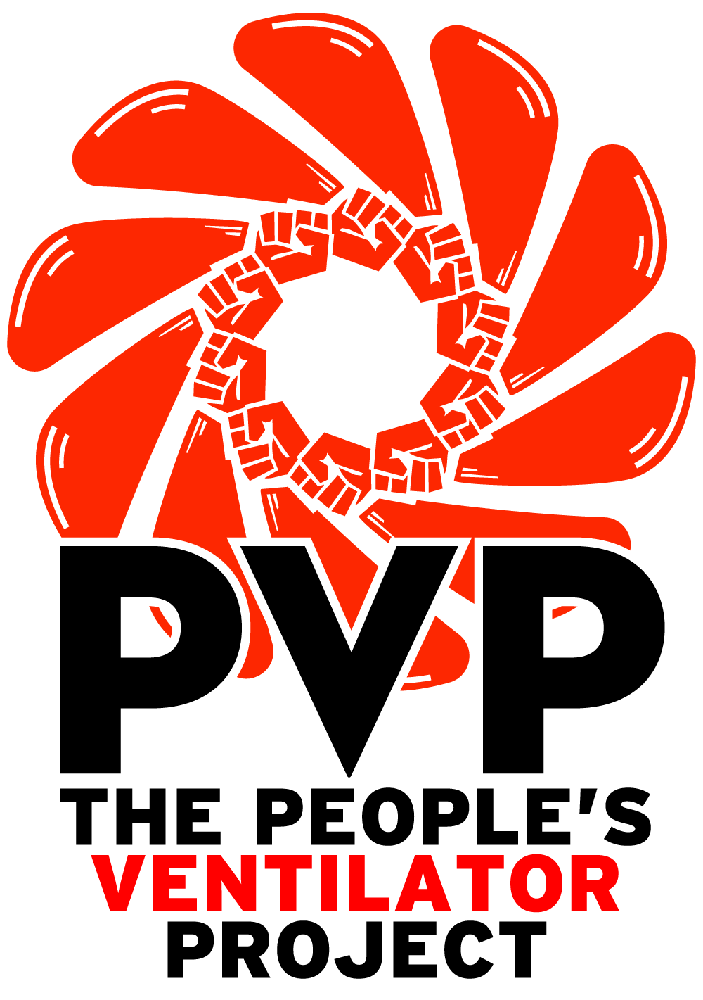

The People's Ventilator Project
======================================

Site Contents
=============

.. toctree::
   :maxdepth: 4
   :caption: Overview

   Control Overview <control_overview>

.. toctree::
   :maxdepth: 4
   :caption: Hardware:

   Hardware Overview <hardware>

.. toctree::
   :maxdepth: 4
   :caption: Software:

   main <main>
   common <common>
   controller <controller>
   coordinator <coordinator>
   GUI <gui>
   io <io>
   alarm <alarm>

.. toctree::
   :maxdepth: 4
   :caption: Resources:

   Ventilator Requirements <requirements>
   Datasheets & Manuals <datasheets>
   Specifications <specs>

.. toctree::
   :maxdepth: 4
   :caption: Meta:

   Changelog <changelog/index>
   Building the Docs <buildthedocs>
   Markdown Example <example_markdown>

Indices and tables
==================

* :ref:`genindex`
* :ref:`modindex`
* :ref:`search`
